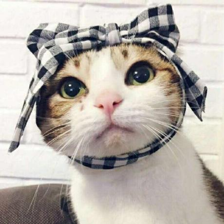
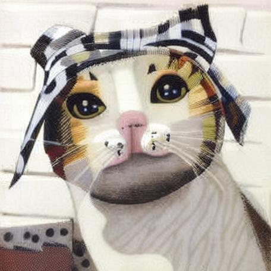
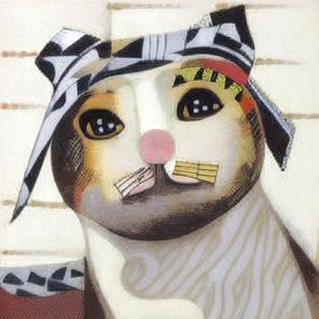
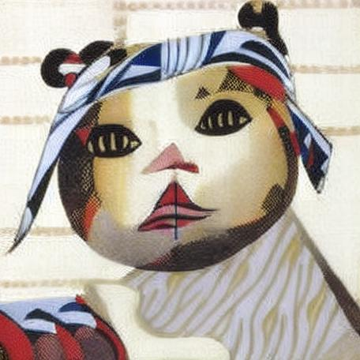

# Image Style Transfer Tool 图像风格迁移工具

## Overview 概述

This project implements an image style transfer tool using the IP-Adapter with Stable Diffusion. It allows users to generate stylized images by providing a base image and a guiding image. 本项目使用 IP-Adapter 和 Stable Diffusion 实现了一个图像风格迁移工具。用户可以通过提供基础图像和引导图像来生成风格化图像。

## System Requirements 系统要求

- **Python 3.12**
- CUDA (recommended for faster inference) 推荐使用 CUDA 以获得更快的推理速度
- (Optional) Apple M1 也可以使用Apple M1芯片

## Installation 安装

Clone the repository 克隆代码仓库：

```shell
git clone https://github.com/gcnyin/image-style-transfer.git
```

Install dependencies 安装依赖：

```shell
python3 -m venv venv
source venv/bin/activate
pip install -r requirements.txt
```

Download the IP-Adapter model. Run the install.sh script. 下载 IP-Adapter 模型，执行 install.sh 脚本：

```shell
./install.sh
```

Note: If the download fails, ensure you have a stable internet connection and retry. 注意：如果下载失败，请确保网络连接稳定并重试。

## Usage 使用

Run the script with the following command 使用以下命令运行脚本：

```shell
python style_transfer.py -c <content_image_path> -s <style_image_path>
```

## Example 示例

```bash
python style_transfer.py -c input.jpg -s style.jpg
```

The generated images will be saved in the current directory with filenames like result-timestamp.jpg. 生成的图像将保存在当前目录中，文件名格式为 result-<时间戳>.jpg。

## License 许可证

This project is licensed under the MIT License. See the LICENSE file for details. 本项目采用 MIT 许可证。详情请参见 LICENSE 文件。

## Acknowledgments 致谢

- [Stable Diffusion](https://github.com/Stability-AI/stablediffusion)
- [transformers](https://github.com/huggingface/transformers)
- [IP-Adapter](https://github.com/tencent-ailab/IP-Adapter/)

## 成果展示

Original Image 原始图像



Style Image 风格图像


Generated Image 生成图像




